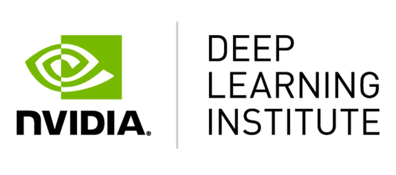

# Fundamentals-of-Deep-Learning

  

[NVIDIA DLI](https://www.nvidia.com/ko-kr/training/)의 "[Fundamentals of Deep Learning (딥러닝의 기초)](https://www.nvidia.com/ko-kr/training/instructor-led-workshops/fundamentals-of-deep-learning/)" 워크숍 레포지토리

## 개발 환경

- [NVIDIA NGC](https://www.nvidia.com/ko-kr/gpu-cloud/)
- JupyterLab

## 목차

### 1. MLP을 사용한 [MNIST 데이터세트로 이미지 분류](/01_mnist.ipynb)

MLP : Multi-Layer Perceptron (다중 퍼셉트론)

- (1) 데이터 로드 및 시각화
- (2) 데이터 편집(재구성, 정규화, 범주형)
- (3) 모델 생성
- (4) 모델 컴파일
- (5) 데이터에 대해 모델 트레이닝

### 2. MLP을 사용한 [미국 수화(ASL) 데이터세트 이미지 분류](/02_asl.ipynb)

ASL : American Sign Language (미국 수화)

- (1) 밀집(Fully-connected) 뉴럴 네트워크 모델 학습
- (2) 트레이닝 정확도가 높음
- (3) 검증 정확도가 낮음
- (4) 과적합의 증거

### 3. CNN을 사용한 [미국 수화 데이터세트 이미지 분류](/03_asl_cnn.ipynb)

CNN : Convolutional Neural Networks (합성곱 신경망)

- (1) 분석
  - CNN으로 검증 정확도를 높임
  - 여전히 트레이닝 정확도가 검증 정확도보다 높음
- (2) 솔루션
  - 정제 데이터가 더 나은 예시를 제공
  - 데이터세트의 다양성이 모델의 일반화에 도움이 됨

### 4. [데이터 증강](/04a_asl_augmentation.ipynb)을 통한 ASL 이미지 분류 모델 개선 & [모델 배포 및 예측](/04b_asl_predictions.ipynb)

#### A. [데이터 증강 (Data Augmentation)](/04a_asl_augmentation.ipynb)

- `Keras`의 [`ImageDataGenerator`](https://keras.io/api/preprocessing/image/#imagedatagenerator-class)라는 이미지 증강 클래스를 사용
  - `from tensorflow.keras.preprocessing.image import ImageDataGenerator`
- 데이터 증강 기법
  - 이미지 반전 (Image Flippimg)
  - 회전 (Rotation)
  - 확대/축소 (Zooming)
  - 너비 및 높이 이동
  - 호모그래피 (Homography)
  - 밝기 (Brightness)
  - 채널 전환 (Channel Shifting)

#### B. [모델 배포 (Model Deployment)](/04b_asl_predictions.ipynb)

- (1) 트레이닝한 모델을 디스크에서 로드
- (2) 다른 형식의 이미지에 대해 트레이닝된 모델의 이미지 형식 변경
- (3) 트레이닝된 모델이 처음 접하는 새로운 이미지로 추론을 수행하고 성능을 평가

### 5. 사전 학습된 모델

#### A. 사전 학습된 모델([VGG16](https://keras.io/api/applications/vgg/))을 통해 [개구멍 자동문 만들기](/05a_doggy_door.ipynb)

- (1) Keras를 사용하여 사전 학습된 모델(VGG16) 로드
- (2) 자체 이미지를 전처리하여 사전 학습된 모델로 작업
- (3) 사전 학습된 모델을 사용하여 자체 이미지에 대한 정확한 추론 수행

#### B. 전이 학습(Transfer Learning)을 통해 [*Bo*를 위한 맞춤형 개구멍 자동문 만들기](/05b_presidential_doggy_door.ipynb)

- 전이 학습을 위한 사전 학습된 모델([ImageNet Model](https://keras.io/api/applications/vgg/#vgg16-function)) 준비
- 사전 학습된 모델로 자체적인 소규모 데이터세트에 대해 전이 학습 수행
- 훨씬 더 나은 성능을 위해 모델을 추가로 파인 튜닝

### 6. New York Times 헤드라인에 기반한 텍스트 자동 완성하기 (시퀀스 데이터)

- (1) [RNN(Recurrent Neural Network)](https://developers.google.com/machine-learning/glossary#recurrent-neural-network)에 사용할 시퀀스 데이터 준비
- (2) 단어 예측을 수행할 모델 구축 및 트레이닝

### 7. [신선한 과일과 썩은 과일 분류기](/07_assessment.ipynb)

## Certificates

